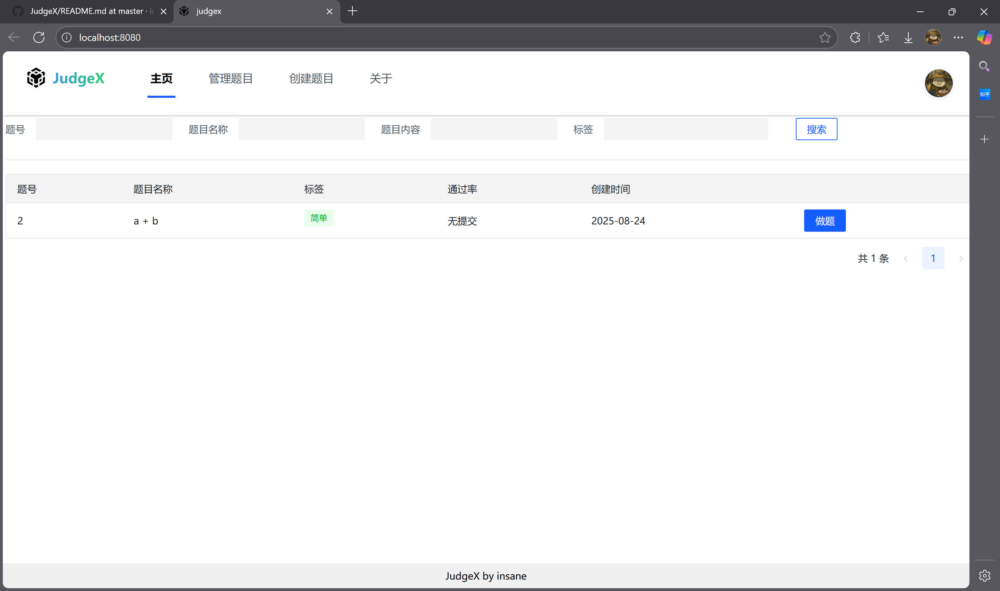
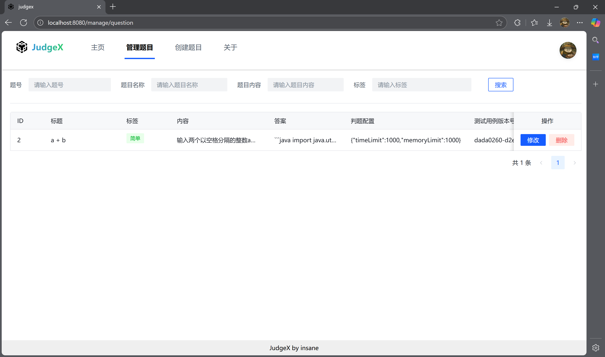
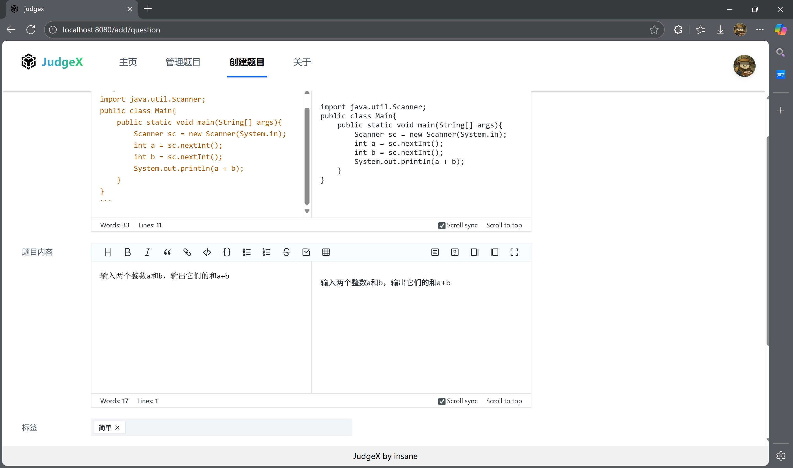
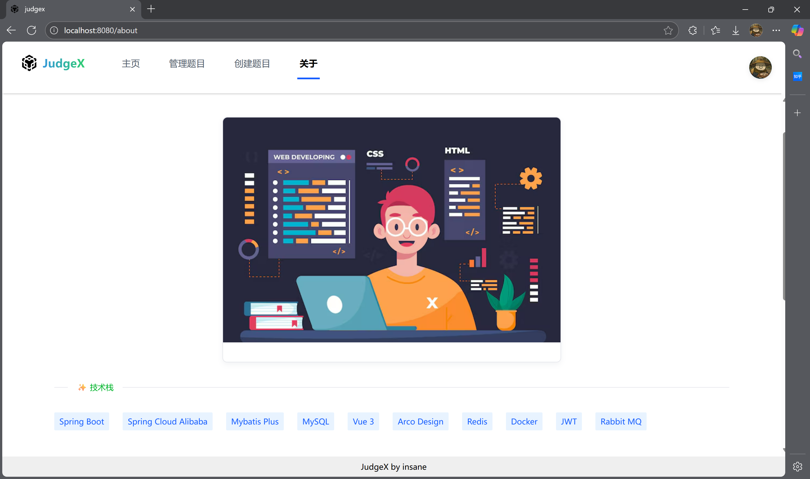
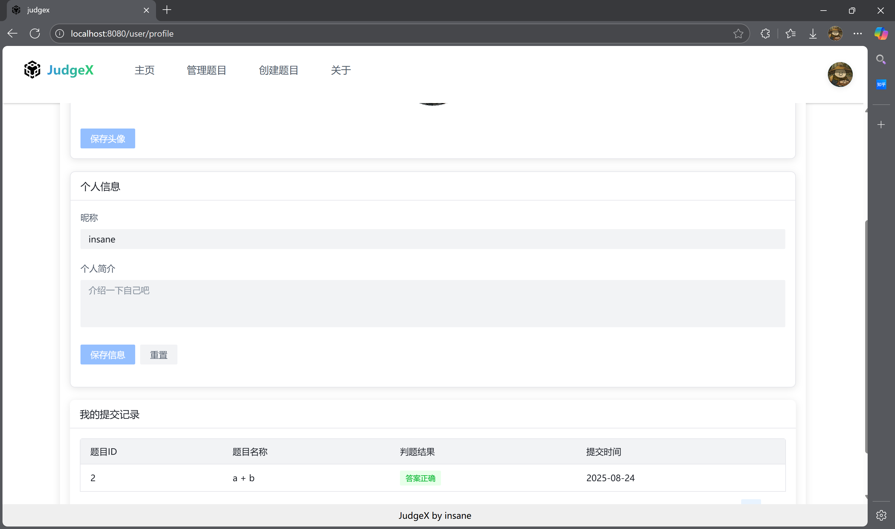
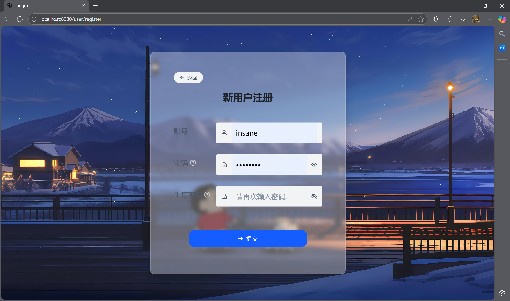
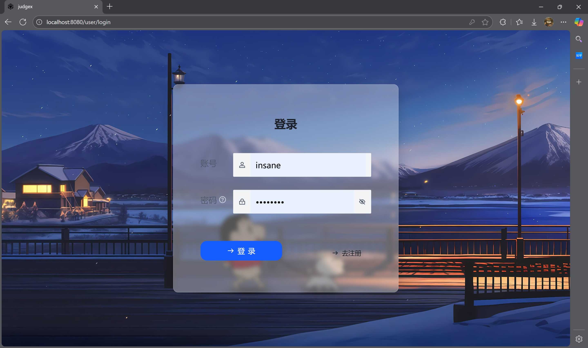

# 效果展示









#  JudgeX 在线判题

## 后端 JudgeX-back

JudgeX-back 是一个在线判题服务的后台系统，支持用户提交代码并进行自动判题，主要用于编程练习、算法竞赛等场景。系统能够接收用户提交的代码，调用代码沙箱执行，并根据预设的测试用例和判题规则对代码进行评判，返回判题结果。

## 技术栈

### 核心框架

- **Spring Boot 2.7.2**：用于快速开发 Java 后端应用，提供自动配置、依赖注入等核心功能
- **Spring MVC**：处理 HTTP 请求，实现 RESTful API 接口

### 数据访问

- **MyBatis-Plus 3.5.2**：基于 MyBatis 的增强工具，简化数据库操作，提供 CRUD 接口、分页等功能
- **MySQL**：关系型数据库，用于存储用户信息、题目数据、提交记录等

### 接口文档

- **Knife4j 3.0.3**：基于 Swagger 的 API 文档生成工具，方便接口调试和管理

### 工具类

- **Hutool**：Java 工具类库，提供 JSON 处理等功能
- **Apache Commons**：提供字符串处理、集合操作等工具类

### 其他

- **Lombok**：通过注解简化 Java 代码，减少 getter/setter 等模板代码
- **AOP**：用于实现日志、权限等横切关注点
- **异步编程**：使用 CompletableFuture 实现判题过程的异步处理

## 架构设计

### 核心模块

1. **用户模块**：处理用户注册、登录、权限管理等功能
2. **题目模块**：管理题目信息、测试用例、判题配置等
3. **提交模块**：处理用户代码提交，记录提交状态
4. **判题模块**：调用代码沙箱执行代码，实现判题逻辑
5. **代码沙箱**：安全执行用户提交的代码，返回执行结果

### 流程设计

1. 用户提交代码到系统
2. 系统记录提交信息，设置状态为 "等待判题"
3. 异步调用判题服务进行判题
4. 判题服务调用代码沙箱执行用户代码
5. 根据执行结果和预设规则进行判题
6. 更新提交记录的判题结果和状态

## 设计模式应用

### 工厂模式

- **代码沙箱工厂（CodeSandBoxFactory）**：根据配置创建不同类型的代码沙箱实例，便于扩展支持多种沙箱实现

```java
CodeSandBox codeSandBox = CodeSandBoxFactory.newInstance(type);
```

### 代理模式

- **代码沙箱代理（CodeSandBoxProxy）**：对代码沙箱的调用进行代理，可以添加日志、监控等额外功能

```java
codeSandBox = new CodeSandBoxProxy(codeSandBox);
```

### 策略模式

- **判题策略（JudgeStrategy）**：定义判题接口，针对不同编程语言实现不同的判题策略
- **策略管理器（JudgeManager）**：根据编程语言选择对应的判题策略

```java
JudgeStrategy judgeStrategy = new DefaultJudgeStrategy();
if ("java".equals(language)) {
    judgeStrategy = new JavaLanguageJudgeStrategy();
}
return judgeStrategy.doJudge(judgeContext);
```

### 建造者模式

- **执行代码请求（ExecuteCodeRequest）**：使用建造者模式构建代码执行请求对象，简化对象创建过程

```java
ExecuteCodeRequest executeCodeRequest = ExecuteCodeRequest.builder()
        .code(code)
        .language(language)
        .inputList(inputList)
        .build();
```

## 核心功能实现

### 判题流程（JudgeServiceImpl）

1. 获取提交信息和题目信息
2. 更新提交状态为 "判题中"
3. 调用代码沙箱执行代码
4. 构建判题上下文，调用判题管理器进行判题
5. 更新判题结果和状态

### 代码提交（QuestionSubmitServiceImpl）

1. 校验提交信息和用户权限
2. 保存提交记录，设置初始状态为 "等待判题"
3. 异步调用判题服务，避免阻塞用户请求

```java
CompletableFuture.runAsync(() -> {
    judgeService.doJudge(questionSubmitId);
});
```

## 配置说明

系统核心配置文件为 `application.yml`，主要配置项包括：

- 数据库连接信息
- 服务器端口和上下文路径
- 会话配置
- 代码沙箱类型配置
- 文件上传大小限制

## 启动说明

1. 配置 MySQL 数据库，创建名为 `judgex` 的数据库
2. 修改 `application.yml` 中的数据库连接信息
3. 运行 `JudgeXBackApplication` 主类启动项目
4. 访问 `http://localhost:8101/api/doc.html` 查看接口文档


# judgex_front 基于vue3的前端页面

> 使用组件库：[Arco Design Vue](https://arco.design/vue/docs/start) 
>  使用的markdown编辑器api: [mdEditor](https://github.com/pd4d10/bytemd)  
>  使用的代码编辑器编辑器api: [monaco-editor](https://github.com/microsoft/monaco-editor)


## 下载远程调用生成相关依赖

```shell
npm install openapi-typescript-codegen --save-dev
```

## 生成远程调用接口代码

```shell
openapi --input http://localhost:8121/api/v2/api-docs --output ./generated --client axios
```

## Project setup

```shell
npm install
```

### Compiles and hot-reloads for development

```shell
npm run serve
```

### Compiles and minifies for production

```shell
npm run build
```

### Lints and fixes files

```shell
npm run lint
```


# Java 代码沙箱

## 项目简介

本项目是一个 Java 代码沙箱，用于安全地执行用户提交的 Java 代码。它提供了两种不同的代码执行实现方式，并运用了设计模式来保证代码的可扩展性和可维护性。

## 代码沙箱的两种实现方式

### 1. 原生 Java 实现（JavaNativeCodeSandBox）

这种实现方式直接在当前系统环境中编译和执行 Java 代码，主要特点如下：

- **执行流程**：
    - 将用户代码保存为本地文件（Main.java）
    - 使用 `javac` 命令编译代码
    - 通过 `java` 命令运行编译后的 class 文件
    - 收集执行结果并进行处理
    - 清理临时文件
- **安全措施**：
    - 设置 JVM 参数限制内存使用（-Xmx256m）
    - 实现超时控制机制（默认 5000ms）
    - 可配置安全管理器（MySecurityManager）限制代码权限
    - 代码关键词黑名单过滤（如 "Files", "exec" 等）
- **优缺点**：
    - 优点：实现简单，无需额外依赖，执行效率高
    - 缺点：安全性相对较低，难以完全隔离用户代码，可能对宿主系统造成风险

### 2. Docker 容器实现（JavaDockerCodeSandBox）

**使用api:** [https://github.com/docker-java/docker-java](https://github.com/docker-java/docker-java)

这种实现方式利用 Docker 容器来隔离执行用户代码，主要特点如下：

- **执行流程**：
    - 将用户代码保存为本地文件
    - 拉取基础镜像（openjdk:8-alpine）
    - 创建并配置 Docker 容器
    - 将本地代码目录挂载到容器内部
    - 在容器中编译和执行代码
    - 收集执行结果（包括输出、错误信息、执行时间和内存占用）
- **安全措施**：
    - 容器网络禁用（withNetworkDisabled (true)）
    - 根文件系统只读（withReadonlyRootfs (true)）
    - 内存限制（100MB）
    - CPU 核心限制
    - 可配置 Linux 内核安全策略（seccomp）
    - 超时控制机制
- **优缺点**：
    - 优点：安全性高，完全隔离用户代码，资源控制精确
    - 缺点：实现相对复杂，需要 Docker 环境支持，执行效率略有损耗

## 项目中使用的设计模式

### 1. 模板方法模式（Template Method Pattern）

**实现类**：`JavaCodeSandBoxTemplate`

**应用场景**：定义代码执行的整体流程框架，将不变的步骤实现，可变的步骤留给子类实现。

**核心代码结构**：

```java
public abstract class JavaCodeSandBoxTemplate implements CodeSandBox {
    @Override
    public ExecuteCodeRespond executeCode(ExecuteCodeRequest request) {
        // 1. 保存代码到文件（固定实现）
        File codeFile = saveCodeToFile(request.getCode());

        // 2. 编译代码（固定实现）
        ExecuteMessage compileMsg = compileFile(codeFile);

        // 3. 运行代码（抽象方法，由子类实现）
        List<ExecuteMessage> runMsgs = runFile(codeFile, request.getInputList());

        // 4. 整理结果（固定实现）
        ExecuteCodeRespond respond = getOutputRespond(runMsgs);

        // 5. 清理文件（固定实现）
        deleteFile(codeFile);

        return respond;
    }

    // 抽象方法，由子类实现具体的运行逻辑
    public abstract List<ExecuteMessage> runFile(File file, List<String> inputList);

    // 其他固定实现的方法...
}
```

**优点**：

- 封装不变部分，扩展可变部分
- 子类只需关注具体实现细节，无需关心整体流程
- 提高代码复用性，便于维护

### 2. 策略模式（Strategy Pattern）

**实现类**：`CodeSandBox` 接口及其实现类

**应用场景**：定义代码执行的策略接口，不同实现类提供不同的执行策略。

**核心代码结构**：

```java
// 策略接口
public interface CodeSandBox {
    ExecuteCodeRespond executeCode(ExecuteCodeRequest request);
}

// 具体策略实现1
public class JavaNativeCodeSandBox extends JavaCodeSandBoxTemplate {
    // 实现具体的本地执行策略
}

// 具体策略实现2
public class JavaDockerCodeSandBox extends JavaCodeSandBoxTemplate {
    // 实现具体的Docker执行策略
}
```

**优点**：

- 可以动态切换不同的代码执行策略
- 客户端可以根据需求选择合适的策略
- 符合开闭原则，新增策略无需修改原有代码

## 快速开始

1. 确保环境中已安装 Java 8 及以上版本
2. 若使用 Docker 实现，需安装 Docker 环境
3. 启动 Spring Boot 应用
4. 发送 POST 请求到 `/executeCode` 接口执行代码

请求示例：

```json
{
  "inputList": [
    "1 2",
    "3 4"
  ],
  "code": "public class Main { public static void main(String[] args) { ... } }",
  "language": "java"
}
```

## 总结

本项目通过两种不同的实现方式提供了 Java 代码的安全执行能力，并运用模板方法模式和策略模式保证了代码的灵活性和可扩展性。原生实现适合对性能要求高且信任执行代码的场景，Docker
实现则适合对安全性要求高、需要严格隔离的场景。
